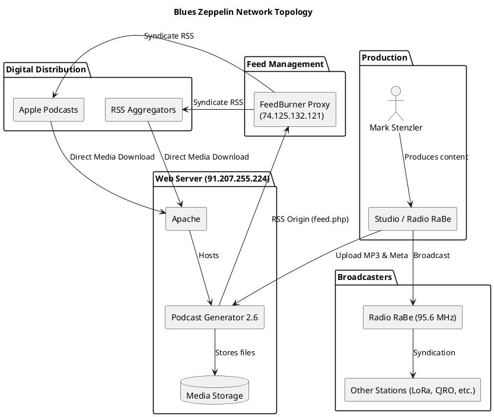

# Blues Zeppelin Network Topology

This document describes the network, server, and application layout of the "Blues Zeppelin" podcast hosted by Mark Stenzler.

## Overview

"Blues Zeppelin" is a long-running radio program (since 1989) based in Bern, Switzerland. It is broadcast on terrestrial radio and distributed as a podcast.

## Infrastructure and Components

### 1. Web and Application Server
- **Domain:** `blueszeppelin.net`
- **IP Address:** `91.207.255.224`
- **Server Software:** Apache (Ports 80, 443)
- **Application:** **Podcast Generator 2.6** (an open-source podcast publishing solution)
- **Path:** `https://blueszeppelin.net/podcast/`
- **Media Storage:** Podcast episodes (MP3 files) are stored at `https://blueszeppelin.net/podcast/media/`.
- **Status:** Ports 80 (HTTP) and 443 (HTTPS) are active.

### 2. Feed Management and Distribution
- **RSS Feed Origin:** Generated by Podcast Generator at `https://blueszeppelin.net/podcast/feed.php` (internal/origin).
- **Public RSS Feed:** `http://feed.blueszeppelin.net/BluesZeppelin?format=xml`
- **Feed Proxy:** Managed via **FeedBurner** (Google), which provides the `feed.blueszeppelin.net` subdomain (IP: 74.125.132.121) and analytics.
- **Apple Podcasts:** The podcast is listed on Apple Podcasts, pulling from the FeedBurner RSS feed.

### 3. Servers
| Name | Function | IP Address | Source | Port 80 | Port 443 |
|------|----------|------------|--------|---------|----------|
| `blueszeppelin.net` | Web / Application Server | 91.207.255.224 | Direct | Open | Open |
| `feed.blueszeppelin.net` | FeedBurner Proxy | 74.125.132.121 | Proxy | Open | Open |

### 4. Software and Systems
| System | Version | Function | Notes |
|--------|---------|----------|-------|
| Apache | Unknown | Web Server | Standard Linux/Apache/PHP stack |
| Podcast Generator | 2.6 | CMS | Outdated, current version is 3.x |
| PHP | Unknown | Scripting | Required by Podcast Generator |

### 5. DNS Configuration
- **Responsible Name Servers:**
    - `ns1.modns.fr`
    - `ns2.modns.fr`
- **Key Records:**
    - **A Record:** `blueszeppelin.net` -> `91.207.255.224`
    - **A Record:** `www.blueszeppelin.net` -> `91.207.255.224`
    - **CNAME:** `feed.blueszeppelin.net` -> `4n30s7.feedproxy.ghs.google.com`
    - **MX Record:** `mx.webmo.fr` (Priority 10)

### 6. Broadcast and Syndication
- **Primary Broadcast:** **Radio RaBe** (Radio Bern, 95.6 MHz) on Sunday afternoons.
- **Radio RaBe IP:** `159.100.249.37`
- **Syndication:** The program is also aired on:
    - Radio LoRa (Zurich, CH)
    - Diis Radio (Canton Valais, CH)
    - CJRO Community Radio (Ottawa, CAN)
    - WRFI Community Radio (Ithaca NY / Odessa NY, USA)
    - Ground Zero Radio Network (Portland OR, USA)

### 5. Online Presence
- **Homepage Redirect:** `https://blueszeppelin.net` often serves as a landing page or redirects to the Radio RaBe program page.
- **RaBe Program Page:** `https://rabe.ch/blues-zeppelin/` serves as the official radio station profile.
- **Social Media:** [Blues Zeppelin Facebook Page](https://www.facebook.com/BluesZeppelin)

## Topology Diagram

*(Note: The above diagram is rendered via the PlantUML server using the encoded source from `diagrams/topology.puml`.)*

## Data Flow

1. **Production:** Audio is produced (likely at Radio RaBe or a private studio).
2. **Upload:** MP3 files and metadata are uploaded to the **Podcast Generator** instance on `blueszeppelin.net`.
3. **RSS Generation:** Podcast Generator updates the RSS feed.
4. **Feed Polling:** **FeedBurner** polls the origin feed and updates `feed.blueszeppelin.net`.
5. **Distribution:**
    - **Apple Podcasts** and other aggregators poll FeedBurner.
    - Listeners download media directly from `blueszeppelin.net`.
