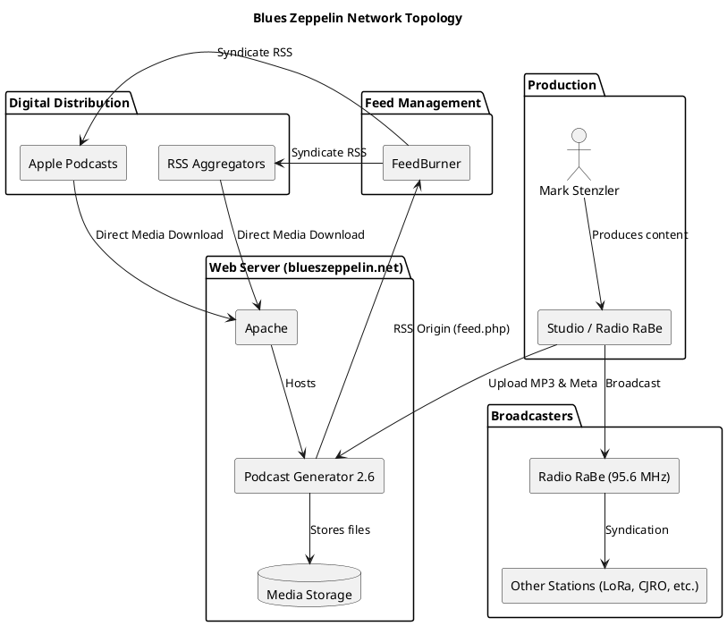

# Blues Zeppelin Network Topology

This document describes the network, server, and application layout of the "Blues Zeppelin" podcast hosted by Mark Stenzler.

## Overview

"Blues Zeppelin" is a long-running radio program (since 1989) based in Bern, Switzerland. It is broadcast on terrestrial radio and distributed as a podcast.

## Infrastructure and Components

### 1. Web and Application Server
- **Domain:** `blueszeppelin.net`
- **Server Software:** Apache
- **Application:** **Podcast Generator 2.6** (an open-source podcast publishing solution)
- **Path:** `https://blueszeppelin.net/podcast/`
- **Media Storage:** Podcast episodes (MP3 files) are stored at `https://blueszeppelin.net/podcast/media/`.

### 2. Feed Management and Distribution
- **RSS Feed Origin:** Generated by Podcast Generator at `https://blueszeppelin.net/podcast/feed.php` (internal/origin).
- **Public RSS Feed:** `http://feed.blueszeppelin.net/BluesZeppelin?format=xml`
- **Feed Proxy:** Managed via **FeedBurner** (Google), which provides the `feed.blueszeppelin.net` subdomain and analytics.
- **Apple Podcasts:** The podcast is listed on Apple Podcasts, pulling from the FeedBurner RSS feed.

### 3. Broadcast and Syndication
- **Primary Broadcast:** **Radio RaBe** (Radio Bern, 95.6 MHz) on Sunday afternoons.
- **Syndication:** The program is also aired on:
    - Radio LoRa (Zurich, CH)
    - Diis Radio (Canton Valais, CH)
    - CJRO Community Radio (Ottawa, CAN)
    - WRFI Community Radio (Ithaca NY / Odessa NY, USA)
    - Ground Zero Radio Network (Portland OR, USA)

### 4. Online Presence
- **Homepage Redirect:** `https://blueszeppelin.net` often serves as a landing page or redirects to the Radio RaBe program page.
- **RaBe Program Page:** `https://rabe.ch/blues-zeppelin/` serves as the official radio station profile.
- **Social Media:** [Blues Zeppelin Facebook Page](https://www.facebook.com/BluesZeppelin)

## Topology Diagram

*(Note: The above link is a placeholder for when the repository is hosted on GitHub. Below is the PlantUML source.)*

## Data Flow

1. **Production:** Audio is produced (likely at Radio RaBe or a private studio).
2. **Upload:** MP3 files and metadata are uploaded to the **Podcast Generator** instance on `blueszeppelin.net`.
3. **RSS Generation:** Podcast Generator updates the RSS feed.
4. **Feed Polling:** **FeedBurner** polls the origin feed and updates `feed.blueszeppelin.net`.
5. **Distribution:**
    - **Apple Podcasts** and other aggregators poll FeedBurner.
    - Listeners download media directly from `blueszeppelin.net`.
